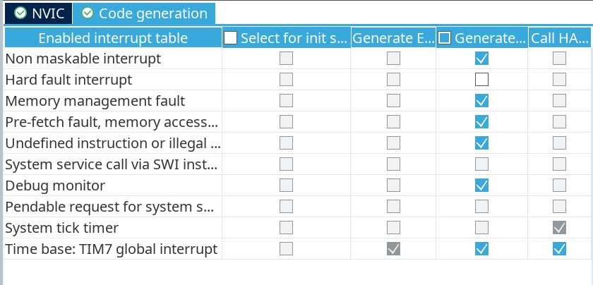

## STM32CubeMX 生成 rtthread-nano 项目

Software Packs 中安装 RealThread.X-CUBE-RT-Thread_Nano

选择 kernel shell libcpu

SYS: Debug:serial Wire; Timebase Source: TIM7

NVIC: Code generation 取消Hard fault interrupt 



USART1: Asynchronous

RTOS RT-Thread：勾选

修改时钟

Project Manager: 勾选Do not generate the main(); 后面自己编写main() 函数

IDE 改为 CMake

生成代码

## 必要的修改

main.c

```c
#include "rtthread.h"

int main() {
  rt_kprintf("Hello\n");

  MX_GPIO_Init();
  MX_SPI3_Init();

  while (1)
  {
    HAL_GPIO_TogglePin(LED_RUN_GPIO_Port, LED_RUN_Pin);
    rt_thread_mdelay(1000);
  }
  
}

```

startup_stm32f407xx.s

将 main 改为 entry

```ASM
/* Call static constructors */
    bl __libc_init_array
/* Call the application's entry point.*/
  bl  entry
  bx  lr    
```

STM32F407xx_FLASH.ld

```
  /* Constant data goes into FLASH */
  .rodata :
  {
    . = ALIGN(4);
    *(.rodata)         /* .rodata sections (constants, strings, etc.) */
    *(.rodata*)        /* .rodata* sections (constants, strings, etc.) */
    . = ALIGN(4);
  } >FLASH

```

在上面的代码下面增加

```
  /* ====== RT-Thread 自动初始化函数指针段 ====== */
  .rti_fn (READONLY) :
  {
    . = ALIGN(4);
    __rt_init_start = .;
    KEEP(*(SORT(.rti_fn*)))
    __rt_init_end = .;
    . = ALIGN(4);
  } >FLASH

  /* ====== RT-Thread FinSH 命令导出符号表段 ====== */
  FSymTab (READONLY) :
  {
    . = ALIGN(4);
    __fsymtab_start = .;
    KEEP(*(FSymTab))
    __fsymtab_end = .;
    . = ALIGN(4);
  } >FLASH

```

至此 rtthread-nano 和 finsh 均正常运行